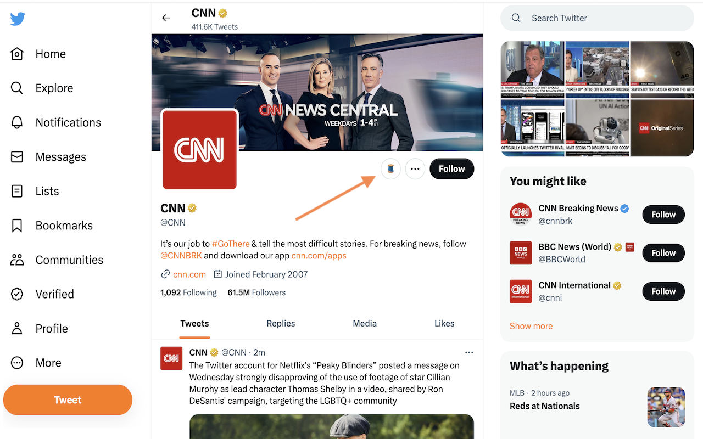

# Twitter Browser Extension

This is a Chrome extension that displays a Open in Threads.net link on Twitter profiles pages.

## Features

- Adds a link to open a Twitter profile on Threads.net

## Installation

1. Clone or download this repository to your local machine.
2. Open Google Chrome and go to `chrome://extensions`.
3. Enable the "Developer mode" toggle at the top right corner.
4. Click on the "Load unpacked" button and select the directory of this extension.
5. The extension will be installed and ready to use.

## Usage

Once the extension is installed, visit the Twitter website and navigate to a user profile page

- On the user profile page, a thread emoji icon will be added to the user actions section. Clicking on the element will open a new tab with the user's profile on threads.net.

## Configuration

No additional configuration is required for this extension.

## Support

If you encounter any issues or have any questions or suggestions, please [open an issue](https://github.com/flrent/chrome-twitter-threads/issues) on the GitHub repository.

## Contributing

Contributions are welcome! If you would like to contribute to this project, please follow these steps:

1. Fork the repository.
2. Create your feature branch: `git checkout -b feature/my-feature`.
3. Commit your changes: `git commit -m 'Add some feature'`.
4. Push to the branch: `git push origin feature/my-feature`.
5. Open a pull request.

## License

This project is licensed under the [MIT License](LICENSE).
